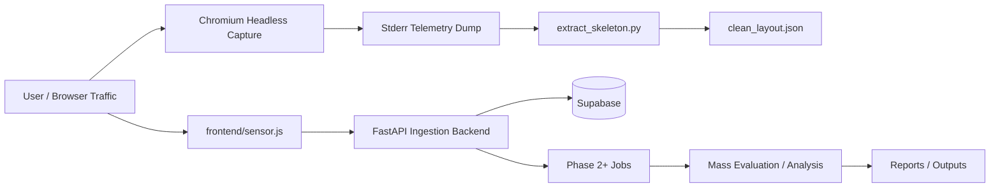

# Headless BAI Desktop Architecture

## Scope

This document describes the full project present on the desktop workspace at
`/home/zibo127/Downloads/Headless_BAI`. The workspace is not a single app; it is a
set of related artifacts that together cover:

- Chromium-based layout capture and telemetry emission.
- A Python extraction bridge that isolates the captured JSON.
- The BAI web application and backend pipeline.
- Mass-evaluation / batch-analysis tooling.
- Supporting docs, patches, and local runtime assets.

Some files in the workspace are production code, some are experimental, and some
are generated outputs or working artifacts. This architecture document explains
how the pieces fit together and which parts are currently active.

## High-Level System View

The project has two major runtime paths:

1. A browser-side capture path that emits DOM/layout skeleton JSON.
2. A telemetry path that records user interactions and stores them in Supabase
   for later analysis.

## Top-Level Workspace Structure

### 1. Chromium capture workspace

Path: `chromium-main/`

This is a local Chromium checkout used to run headless captures and emit layout
skeleton data. It is not the core product, but it is the instrumentation surface
that produces the JSON consumed by the rest of the pipeline.

Relevant pieces:

- `chromium-main/src/third_party/blink/renderer/core/frame/local_frame_view.cc`
  contains the lifecycle hook that emits BAI skeleton output.
- `chromium-main/src/content/browser/renderer_host/render_process_host_impl.cc`
  forwards the opt-in telemetry flag into the renderer process.
- `chromium-main/src/out/Default/chrome` is the built browser binary.
- `local_fonts.conf` is used during headless runs to stabilize font rendering.

This subtree is large and build-heavy. It is a local tooling dependency, not a
lightweight source module.

### 2. Extraction bridge

Path: `extract_skeleton.py` and `clean_layout.json`

This bridge converts noisy stderr output from headless Chrome into clean JSON.

- `extract_skeleton.py` reads `/tmp/bai_skeleton.txt`.
- It extracts only the text between:
  - `=== BAI_SKELETON_START ===`
  - `=== BAI_SKELETON_END ===`
- It validates the payload as JSON.
- It writes the normalized result to `clean_layout.json`.

This step separates the browser diagnostic stream from the usable layout payload.

### 3. BAI application package

Path: `bai-final-year/`

This directory holds the main BAI application deliverables.

Key submodules:

- `bai-final-year/frontend/`
  - `sensor.js`: client-side telemetry collector.
  - `demo-website/`: sample target site for interaction capture.
  - `test.html`: manual validation page.
- `bai-final-year/backend/`
  - FastAPI backend, routers, schemas, and background jobs.
- `bai-final-year/docs/`
  - architecture, API, schema, and progress documentation.
- `bai-final-year/docker/`
  - container runtime support.
- `bai-final-year/data/`
  - supporting utilities such as the ghost-user generator.

This subtree is the closest thing to a standalone product package.

### 4. Mass evaluation and analysis

Path: `mass_evaluation/` and `outputs/`

These folders contain batch-processing and report-generation artifacts.

- `mass_evaluation/1_corpus_scanner.py`
- `mass_evaluation/2_extract_targets.py`
- `mass_evaluation/3_serve_corpus.py`
- `mass_evaluation/4_mass_synthetic_traffic.py`
- `mass_evaluation/5_master_batch_pipeline.py`
- `mass_evaluation/6_generate_report.py`

The `outputs/` folder contains the packaged writeups and canonical phase
summaries used to document the system.

### 5. Working artifacts and local-only assets

- `patch_backup/`: local patch copies of Chromium changes.
- `.env` and `venv/`: local sensitive/runtime state, intentionally not public.
- `out/`: build output.
- `clean_layout.json`: derived data from the extraction bridge.

These files are part of the desktop workspace but should generally not be
published as source artifacts.

## Core Runtime Layers

### Layer 1: Browser instrumentation and capture

This layer is responsible for observing page structure and emitting a skeleton
layout snapshot.

#### Entry points

- Chromium runs in headless mode.
- The renderer receives an opt-in command-line switch.
- The lifecycle hook in `LocalFrameView` emits a DOM tree and bounding boxes.

#### Data produced

The emitted payload is a JSON object with a `nodes` array. Each node typically
includes:

- `name`
- `depth`
- `x`
- `y`
- `width`
- `height`

#### Output channel

The payload is written to stderr alongside diagnostic messages. This is why the
bridge step is needed: stderr contains both useful JSON and unrelated runtime
noise.

### Layer 2: Extraction bridge

This layer isolates the JSON skeleton from stderr.

#### Responsibilities

- Read the raw capture file.
- Locate the last skeleton block.
- Validate that the block is valid JSON.
- Normalize formatting with indentation.
- Save the clean structure to disk for downstream consumers.

#### Why it exists

The browser output is intentionally noisy because it mixes:

- lifecycle diagnostics,
- skip reasons,
- fontconfig warnings,
- and actual skeleton payloads.

The bridge provides a deterministic handoff into the rest of the pipeline.

### Layer 3: Web telemetry application

This is the main BAI app layer in `bai-final-year/`.

#### Frontend

The telemetry sensor (`frontend/sensor.js`) captures pointer interactions in the
browser and batches them.

It:

- creates or recovers a session identifier,
- records pointer events,
- flushes buffered interactions periodically,
- sends them to the backend using beacon or fetch,
- falls back gracefully if storage or networking is constrained.

The frontend is intentionally lightweight and dependency-free.

#### Backend

The backend is a FastAPI service in `bai-final-year/backend/main.py`.

It provides:

- health checks,
- telemetry ingestion endpoints,
- statistics endpoints,
- background processing hooks,
- Supabase persistence integration.

Related backend modules include:

- `schemas.py` for request/response validation.
- `routers/ingest.py` for telemetry ingestion.
- `routers/admin.py` for warm-up and debug operations.
- `jobs/process_events.py` for batch event processing.
- `jobs/warm_skeletons.py` for pre-warming or preprocessing workflows.
- `filters/bot_detector.py` for bot filtering.
- `mappers/coordinate_mapper.py` for coordinate normalization or mapping.
- `extractors/playwright_extractor.py` for browser-driven extraction tasks.

#### Storage

Supabase acts as the persistence layer for telemetry and derived statistics.
The backend validates environment variables before startup so credentials are
required at runtime.

### Layer 4: Batch analysis and reporting

The mass-evaluation layer processes accumulated traffic and corpus data.

#### Functions

- Scanning corpora and collecting targets.
- Serving test content locally.
- Generating synthetic traffic.
- Running the master batch pipeline.
- Producing reports and summarized outputs.

#### Pipeline structure

`mass_evaluation/5_master_batch_pipeline.py` orchestrates:

- loading traffic results,
- clustering behavior patterns,
- extracting features,
- fitting a statistical learning model,
- producing recommendations and improvement reports.

The current implementation contains scaffolding and TODOs, which means the
architecture is in place even where the modeling logic is not fully implemented.

## End-to-End Data Flows

### Flow A: Chromium skeleton capture

1. A headless Chromium instance loads a page.
2. The renderer lifecycle hook emits layout JSON to stderr.
3. Runtime diagnostics and skip reasons are also written to stderr.
4. The capture is saved to `/tmp/bai_skeleton.txt`.
5. `extract_skeleton.py` extracts and validates the JSON block.
6. The normalized result is written to `clean_layout.json`.

This flow is used to turn browser state into structured layout data.

### Flow B: User interaction telemetry

1. A target page loads `frontend/sensor.js`.
2. The sensor attaches pointer-event listeners.
3. The sensor batches interaction events locally.
4. Every few seconds, or on page hide, the batch is flushed.
5. The backend receives the payload.
6. The backend stores the data in Supabase.
7. Later jobs and reports consume the stored telemetry.

This flow is used to collect real interaction data from browsers.

### Flow C: Mass analysis and reporting

1. The system runs the corpus scanner and extraction scripts.
2. Synthetic traffic is generated against a target corpus.
3. Results are fed into the master batch pipeline.
4. Clustering and statistical modeling produce insights.
5. Reports are written into `outputs/` or adjacent metadata folders.

This flow is used for evaluation, benchmarking, and project documentation.

## Directory Map

### Root files

- `README.md`: top-level summary of the desktop workspace.
- `docker-compose.yml`: local container orchestration.
- `extract_skeleton.py`: stderr-to-JSON bridge.
- `clean_layout.json`: extracted layout payload.
- `local_fonts.conf`: local fontconfig configuration for headless capture.

### `bai-final-year/`

- `.env.example`: environment template.
- `frontend/`: telemetry sensor and demo UI.
- `backend/`: FastAPI service and supporting logic.
- `docs/`: architecture and operational docs.
- `docker/`: container runtime files.
- `data/`: helper scripts.

### `mass_evaluation/`

- Corpus scanning and serving helpers.
- Synthetic traffic generation.
- Master batch pipeline.
- Metadata and corpus inventories.

### `outputs/`

- Phase summaries.
- Architecture and quick-start documents.
- Packaged mass-evaluation scripts.

### `chromium-main/`

- Local Chromium source tree and build artifacts.
- Renderer-side instrumentation used to generate skeleton data.

### `patch_backup/`

- Saved copies of Chromium patch files.
- Useful for reference, but not part of the primary runtime.

## Operational Notes

- The desktop workspace mixes source, generated output, and local toolchains.
- The Chromium checkout is intentionally local and should not be treated as a
  normal application dependency in public documentation.
- Environment files and virtual environments are local-only state.
- `clean_layout.json` is derived data, not a source of truth.
- Several files in `mass_evaluation/` and `outputs/` are scaffolded or partially
  implemented; they define the intended architecture even where code is still
  a placeholder.

## Current Architectural State

The project has three distinct maturity levels:

1. **Working capture and extraction path**
   - Chromium emits layout JSON.
   - The Python bridge produces clean JSON.

2. **Working telemetry application skeleton**
   - Frontend sensor and FastAPI backend define the data collection system.
   - Supabase is the persistence layer.

3. **Planned batch intelligence layer**
   - Mass evaluation, clustering, and reporting are architected.
   - Some implementation details remain stubbed or TODO-marked.

This makes the workspace a combined product + research + tooling desktop,
not just a single repository.
